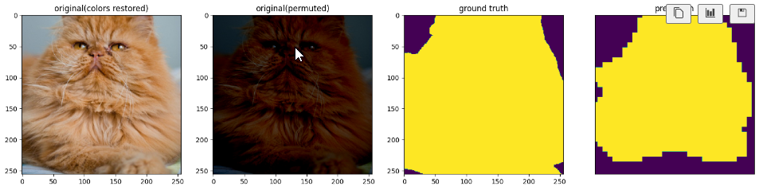
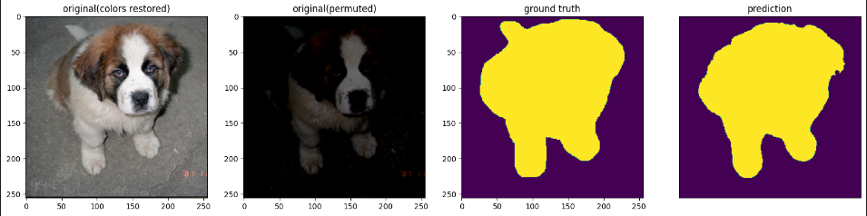

# Animal_Segmentation
Image segmentation on the Oxford-iiit pet dataset using CNNs, GNNs, and U-Nets. The basic CNN is only there to test the code. The goal was to test the effectiveness of [SCG-Net: Self-Constructing Graph Neural Networks for Semantic Segmentation](https://arxiv.org/pdf/2009.01599.pdf). The version with the variational auto-encoder was very bad and basically did just predict one class. Using a normal auto-encoder improved the result but it was still not good enough for me, also the interpolation used led to a very non-smooth image as can be seen below(sorry for the mouse but I am too lazy to redo the img).

This brought me to try U-net too. The results of this model were acceptable as can be seen below:

All methods could have worked better with longer training times, but my hardware and patience are limited. I have also changed/improved U-nets architecture successfully, but the model is for now not to be published because of a university project.
